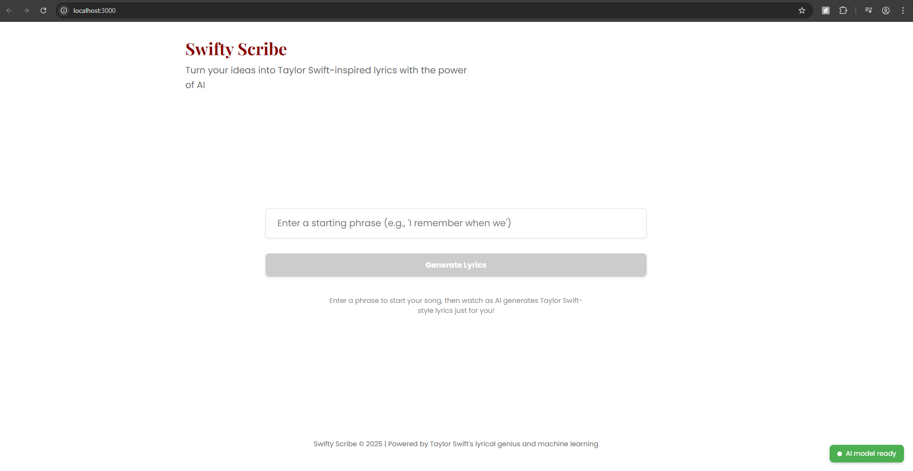
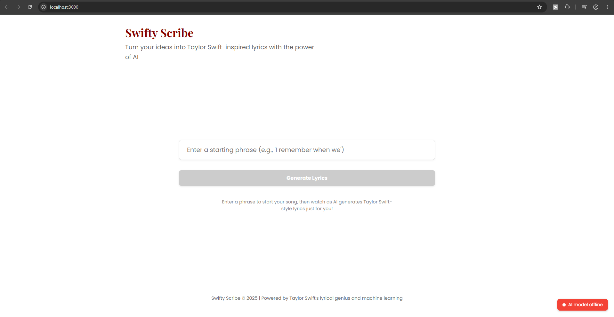
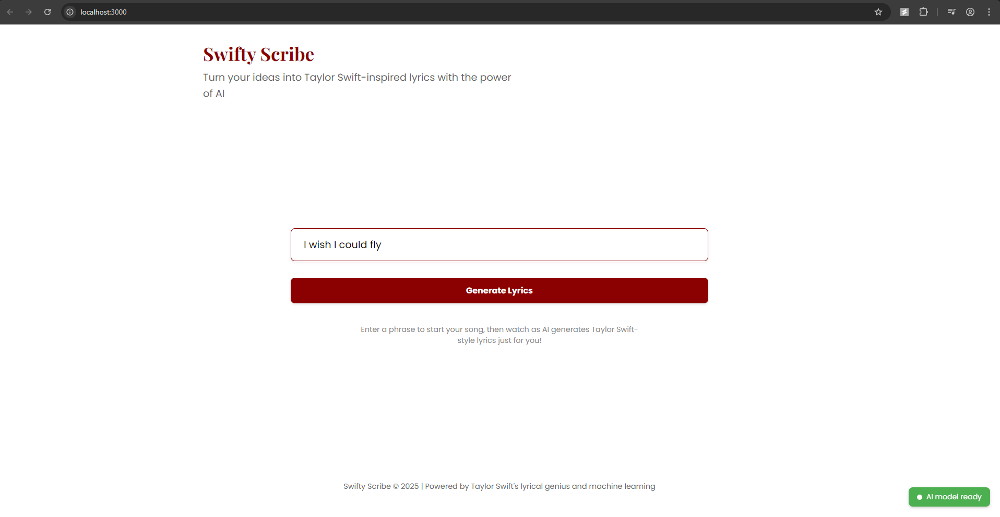
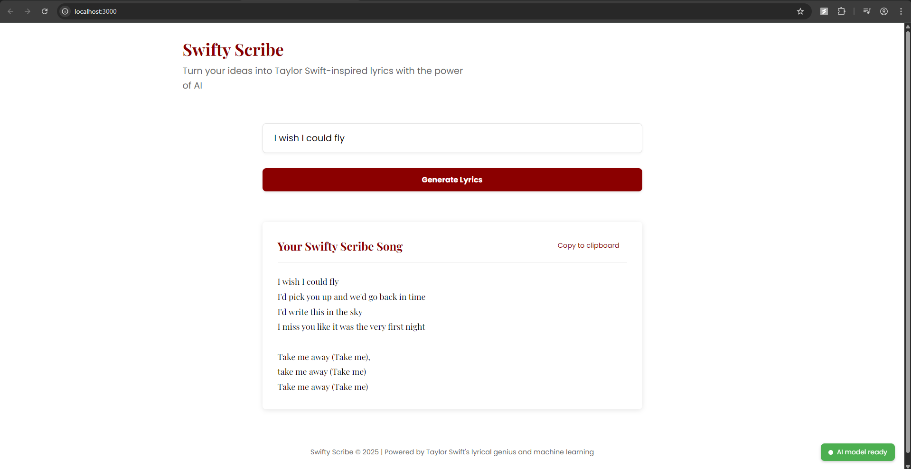

# SwiftyScribe: Taylor Swift-Inspired Lyrics Generator

SwiftyScribe is an AI-powered application that generates Taylor Swift-style song lyrics using a recurrent neural network (RNN) trained on Taylor Swift's song lyrics corpus.


## Features

- **AI-Powered Lyrics Generation**: Generates original lyrics in the style of Taylor Swift
- **Interactive UI**: Modern React frontend with animations and responsive design
- **RESTful API**: Flask backend with easy-to-use endpoints for lyrics generation


## Tech Stack

### Backend
- Flask (Python web framework)
-  PyTorch (Deep learning library)
-  Transformers (NLP library from Hugging Face)
- RNN-based neural language model

### Frontend
-  React
-  Styled Components
- Framer Motion (for animations)
-  Axios (for API requests)

## Implementation Details

### Natural Language Processing Pipeline

SwiftyScribe implements a sophisticated NLP pipeline for lyric generation:

1. **Tokenization**: Using GPT2TokenizerFast from Hugging Face's Transformers library, the model tokenizes input text and Taylor Swift's lyrics corpus into subword tokens. Special tokens like `<s>` (beginning of sequence), `</s>` (end of sequence), and `<|endoftext|>` (padding) are added to control text generation.

2. **Text Chunking**: To create training data, the lyrics are split into manageable chunks of 64 tokens, with appropriate start and end tokens. This ensures the model learns the context and structure of song lyrics.

3. **Word Embeddings**: The RNN model uses a 64-dimensional embedding layer that maps token IDs to dense vector representations, capturing semantic relationships between words.

4. **Recurrent Neural Network**: A Gated Recurrent Unit (GRU) with 1024 hidden dimensions processes the embedded tokens sequentially, maintaining memory of previous words to predict contextually appropriate next words.

5. **Layer Normalization**: Applied after the GRU to stabilize training and improve model convergence.

6. **Sampling with Temperature**: During generation, a temperature parameter controls randomness - higher values (>1.0) increase creativity while lower values (<1.0) make output more predictable and focused.

7. **Post-Processing**: Generated text is formatted into song-like structures with appropriate line breaks and stanzas to enhance readability and authenticity.

## Project Structure

```
swifty-scribe/
├── backend/              # Flask API
│   ├── app/              # Application code
│   │   ├── models/       # ML models
│   │   └── routes/       # API routes
│   ├── venv/             # Python virtual environment
│   ├── requirements.txt  # Python dependencies
│   ├── train_model.py    # Script to train the model
│   └── wsgi.py           # WSGI entry point
│
├── frontend/             # React frontend
│   ├── public/           # Static files
│   ├── src/              # React components and logic
│   │   ├── components/   # UI components
│   │   ├── pages/        # Page components
│   │   ├── assets/       # Images, fonts, etc.
│   │   └── services/     # API service layer
│   └── package.json      # Node.js dependencies
│
└── songs.csv             # Dataset of Taylor Swift lyrics
```

## Getting Started

### Prerequisites

- Python 3.8+ with pip
- Node.js 14+ with npm
- Taylor Swift lyrics dataset in CSV format

### Backend Setup

1. Create and activate a virtual environment:
   ```
   cd backend
   python -m venv venv
   # On Windows:
   venv\Scripts\activate
   # On Unix/MacOS:
   source venv/bin/activate
   ```

2. Install dependencies:
   ```
   pip install -r requirements.txt
   ```

3. Train the model:
   ```
   python train_model.py ../songs.csv
   ```

4. Start the Flask server:
   ```
   python wsgi.py
   ```

### Frontend Setup

1. Install dependencies:
   ```
   cd frontend
   npm install
   ```

2. Start the development server:
   ```
   npm start
   ```

3. The application will be available at http://localhost:3000

## API Endpoints

- `GET /api/health` - Check if the API and model are running
- `POST /api/generate` - Generate lyrics based on a prompt
  - Parameters:
    - `prompt` (string): The starting text for generation
    - `max_length` (int, optional): Maximum length of generated text
    - `temperature` (float, optional): Controls randomness of generation

## Model Architecture

The lyrics generation model is based on a recurrent neural network (RNN) with GRU cells. It uses word embeddings and is trained on a corpus of Taylor Swift's lyrics to capture her unique writing style and themes.

## Results

### Home Screen (Model Online)

*The main interface of SwiftyScribe, showing the prompt input field and the green "AI model ready" status indicator.*

### Model Offline State

*When the backend model is not available, the UI clearly communicates this to the user with a red indicator.*

### Prompt Input and Generation

*Users enter a starting phrase to initiate the lyrics generation process.*

### Generated Output

*An example of Taylor Swift-style lyrics generated by the model based on a user prompt.*
